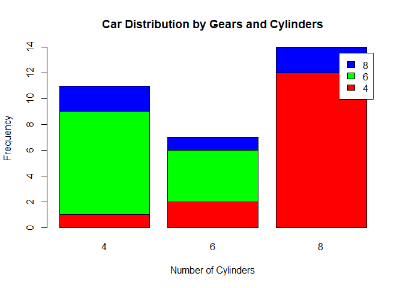
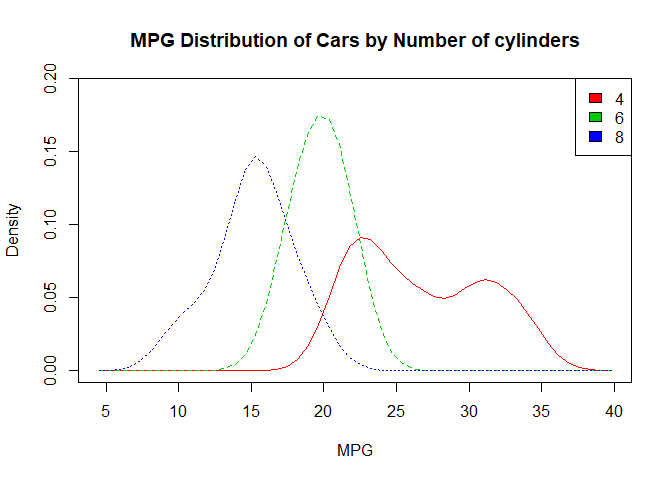
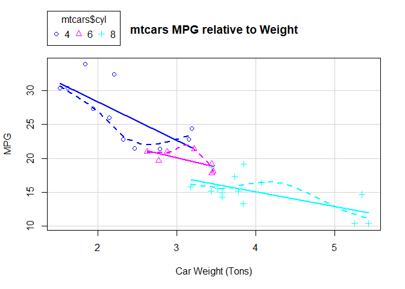

Visual Analytics Module 7 Assignment
================

For this assignment, I have chosen three graphs to show visual distribution analysis. Each of these graphs are unique from one another in that they not only look different, but they detail different data and portray different conclusions to the reader.

``` r
counts = table(mtcars$gear, mtcars$cyl)

barplot(counts, main = "Car Distribution by Gears and Cylinders", xlab = "Number of Cylinders", ylab = "Frequency", col = c("red","green","blue"), legend = colnames(counts))
```

 The first graph I have chosen is a bar graph depicting the distribution of the cars by number of gears and cylinders. This is a grouped frequency distribution, however due to the nature of the grouping and factoring of the data, it is not possible to determine normality as well as individual terminologies such as the mean, median and mode. Rather, this graph is meant to give a quick general view of the data distribution in the dataset.

``` r
library(sm)
```

    ## Package 'sm', version 2.2-5.6: type help(sm) for summary information

``` r
mtcars$cyl = as.factor(mtcars$cyl)
sm.density.compare(mtcars$mpg, mtcars$cyl, xlab = "MPG")
title("MPG Distribution of Cars by Number of cylinders")
colfill<-c(2:(2+length(levels(mtcars$cyl))))
legend(x = "topright",legend = c(4,6,8),fill = colfill)
```

 The second graph I have created is a density plot comparing the MPG distribution compared to the number of cylinders for each car in the dataset. This is a very detailed and complete graph that visualizes normality and distribution concerning number of cylinders as well as MPG. We can see that the data using 6 and 8 cylinders is normally distributed with a symmetric distribution, however the 4 cylinder data seems to skew left. We can also see that the mode for each line looks to be ~15 MPG for 8 cylinders, ~20 MPG for 6 cylinders, and ~23 MPG for 4 cylinders. We can also assume the median to be 15 and 20 for each 8 and 6 cylinder lines, respectively, however the median for 4 cylinder data is a bit more ambiguous.

``` r
library(car)
```

    ## Loading required package: carData

``` r
scatterplot(mtcars$mpg~mtcars$wt | mtcars$cyl,xlab = "Car Weight (Tons)", ylab = "MPG", main="mtcars MPG relative to Weight")
```

 The last plot I have created is a scatterplot showing car MPG relative to weight and categorized by number of cylinders. We can clearly see how each of the categories (4, 6 and 8 cylinder cars) are separated and how each of them seem to occupy their own subsection of the scatterplot. 4 Cylinder cars seem to have the highest MPG, while 8 cylinder cars have the lowest MPG, with 6 cylinder cars being in the middle. Again, judging by this plot, it looks as if 6 and 8 cylinder car data is normally distributed and relatively symmetrical, however it still appears that 4 cylinder car data is skewed left.
